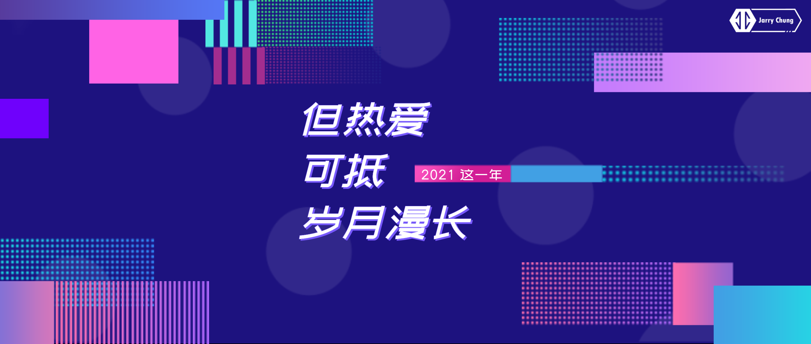
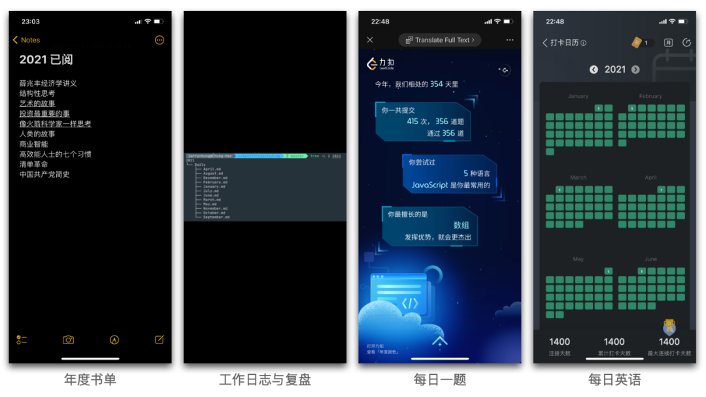
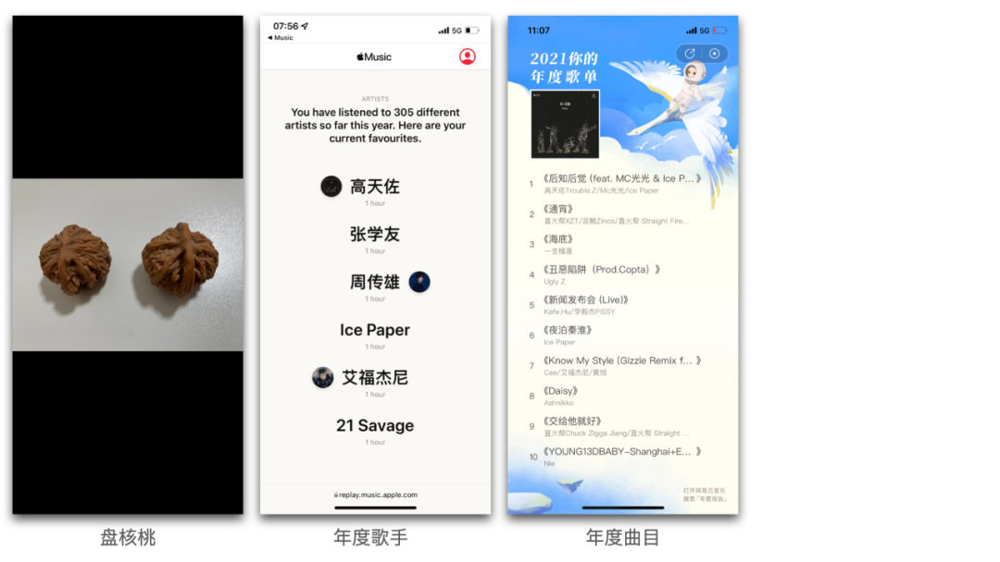

> 保持脉搏张力。

在 2019 年的年度总结中，有评论说道：刚毕业时满腔热血，但工作几年后就没动力了。

我看到这句话的第一感觉是畏惧，畏惧自己会散去热情、率尔操觚、泯然众人。第二感觉便是动力，我开始向内探索，寻找保持热情的根本动力。2021 这一年，作为第一个五年计划的第四年，是节奏比较慢的一年，借助这种慢节奏，让自己缓下来思考，我的一些想法得到了更高程度的抽象，同时更加坚定了自己的前进方向，血脉张力依旧。

## 请回答2021

出乎意料的是，在 2021 年“精心设计”的目标，其完成度并不理想，有几方面值得记录一下。

首先是技术学习，年初制定了一系列技术学习的目标，但效果并不理想。其根本原因在于，**各目标貌合神离，无法用一条清晰的主线串联起来**，导致的结果是，**学习的成果是分散的，上一环节学习的内容无法在下一环节使用、验证，无法形成闭环**，学完不久后就忘记了，获得感大打折扣。

其次是刷题，目标是每天至少刷一道题，借助一万小时理论来提升自己的算法水平。浅层次的目标(每天至少一道题)可以算是达成，但在刷题过程中缺少总结，导致无法形成体系，原因在于自身对算法的重视程度有所降低，被其它事情瓜分了注意力，**一万小时的重复劳动不会带来质的提升**。

此外，今年还坚持每日练字至少 15 分钟，但是对于提升字的美感并不明显，离开了练字环境再写字就会原形毕露。不过在练字的过程中有另一个收获：**借助这 15 分钟的高度专注时间，心无旁骛，能帮我获得一种平和的状态**，进而引导一整天的平和稳定状态。

最后是读书，坚持每日阅读至少 30 分钟，聚沙成塔，今年共阅读了 10 本书，其中最值得推荐的是《艺术的故事》(从艺术发展看人类发展，从人类发展进程思考事物合理性)、《像火箭科学家一样思考》(学习不同角度的思考方式)以及《投资最重要的事》(了解成为韭菜的过程中哪些事情不该做)。

总的来说，今年的执行有些混日子的意思，欠缺合理的、符合自身实际的 PDCA 循环，导致效果并不理想。在做下一年的规划时，**要敦本务实，不可避重就轻**。

## 新说上行

在制定与完成目标的 PDCA 中，根本目的是为了螺旋上行。但何种上行才是最重要的？当前我主要关注两方面：**同理心与通用能力**。

同理心是对他人的情绪、想法、立场、行为等有真正的理解，往往还能做出适当的反应。同理心的强度决定着自身对他人、外界的开放程度，具备同理心才有可能进行有效的沟通、学习，否则容易掉入相互反驳、自我思想封闭的陷阱。

通用能力，是指**脱离于具体的技术、业务，在普遍领域上都能使自己具备价值的能力**。简单的说，通用能力可以让自己换个工作场景也能快速找到自己的节奏与价值。因之，掌握了某项技术或业务，却不能从这些内容中向上建树、抽象出通用能力，不能称为上行。我通过“**实践-抽象-具体-检验**”的步骤来提升通用能力，具体来说，可以分为几个步骤：记录实践中的经验、从这些经验中抽象出本质、依据本质得出这一类型问题的共性解决方案、然后制定计划在实践中检验。

抽象出来的本质往往是可复制的，与实践场景结合后产生出来的具体内容是独特的，我认为**可复制的本质才是更重要的**。

举个例子，如何学习一门新语言。最直接的做法是看官方文档、看教程视频，看完一遍教程后，可能记住的内容并不多。如果深入语言本质，会发现**各种语言本质上是提供了一系列 api 以及抽象机制**，再进行分类的话，会发现不同语言间的思考方式会存在差异，例如 C++ 的是从 CPU 的角度来思考的，而 SQL 是从数据的角度来思考的。如果能通过新语言的思考方式、抽象方式、api 来学习的话，理解会更透彻。

再举个详细的例子，如何理解前端。

就实践这一层面来说，它是通过前端技术、编码来完成产品需求。但若只停留在这一层，容易造成只钻研技术、排斥其他与技术无关的行为(如开会)的心态，导致看不到全局。如果能进行抽象，看到本质，那么**前端可以定义为围绕面向用户的、为用户提供服务、提升用户体验的一系列思维与行为**，而不特指某种语言或技术，技术只是手段之一。基于这个抽象，前端是涵盖了产品定义、编码实现、后期服务等方面，因此前端工程师要做的不仅仅是编码工作，还更应关注到产品的整个生命周期。有了这个定义后，可以自上而下的寻找实现手段，然后制定计划进行检验。利用这个循环，能使前端工程师的通用能力螺旋上行。

**在工业界，只会写代码的程序员写不好代码**。

## 谋定而后动

奠定思维后，可以从主线与副本两条路线来实践。

主线是一个长期目标，需要分阶段进行。这个**目标一定是可感知的**，这样才可以清晰地看到自己离目标究竟是越来越近还是越来越远。所以一个好的上行目标的制定，首先要让自己能明确感知到，其次当它达成的时候，可以给自己带来很强的获得感。这种感知不一定能让自己立刻放下那些拖后腿的事情，但会增加一种压力，让自己走入不舒适区。除此之外，这个目标的实现还必须在回望的时候有一种“获得感”。重中之重，**只有那些位于长期目标道路上的短期目标，才真正值得去实现**。

在制定主线目标时，高职级能力是一个很好的参考方向。以多个行业作为参考，可以避免自己掉入视野单一的陷阱，越是专业越容易视野单一、思维定性。

在实现目标的过程中，有几点需要额外注意：

其一，不要凭感觉，不要企图使某些尚未明确的事情显得确凿无疑，一定要列举证据；

其二，对陌生事物产生奇怪的感觉并不能证明它是错的；

其三，不要过度强调效率，效率是创新的敌人。当强调“效率”时，其实就是在追求局部最优解，会导致看不到全局。

副本是作为补充的存在，往往是一些习惯养成、刻意练习。在做副本时，可以利用清单将副本可视化，降低记忆负担，同时将副本流程化，便于执行与传承。以下几个是比较重要的副本：一叶知秋、倾听时以理解为目的、做需求时思考业务价值等。

## 读书

关于阅读，不得不深入思考的是：阅读的目的是什么，以及该如何阅读。

以阅读量为目的而读书是无效的，因为人类不可能胜过电脑；以认知提升为目的而读书是虚无的，因为无法检验是不是真提升了。唯一的路径，**只能以输出、解决真实的问题为目标来阅读**。

我读一本书大致可分为四个步骤：**阅读、思考、行动、证明**。

阅读这个行为确保了我有信息增量，在阅读时，要联系时代背景与作者背景，读书中内容，更是读作者，获取看问题的不同角度。思考则要求借助阅读产生的信息，进行自我关联，寻找书中知识与自身生活的映射，从而产生出解决生活问题的思路。行动是指在实践中验证自己思考的结论是否可行有效。在证明阶段，证实证伪不重要，重要的是形成闭环，营造开端。

我通过写卡片的方式(我采用flomo)来记录原文摘录、我的转述、个人体验、行动指引等。

## 保持思想开放

在阅读过程中，一件很重要的事情是要保持思想开发，先接受作者的观点，理解后再用自己的观点审视，避免先入为主，这样才能认真的体会作者的思想，并尝试从作者的角度看问题。同样的，在读书之外，也需要保持思想开放。

保持思想开放，也就是能理解并接纳他人的观点。**在沟通时，应以理解对方观点作为首要目的，其次才是融合自己的思考并作出回应**。如果急于作出回应，容易变得先入为主，不利于沟通。

单拎这一点出来讲，是因为我察觉到自己有思想封闭的趋势，即倾听时，为了维护自身观点，会下意识的寻找对方观点破绽，而不是着重理解对方的含义，从而导致沟通结果并不理想。故作记录以为鉴。

## 文不如图

一些平凡、快乐、值得留存的记忆

## 请期待2022

2022 年，第一个五年计划的最后一年，需要一个复盘式的计划来完成前几年的闭环，同时为下一个五年作准备。

## 终

看见一座山，就想知道山后面有什么。
