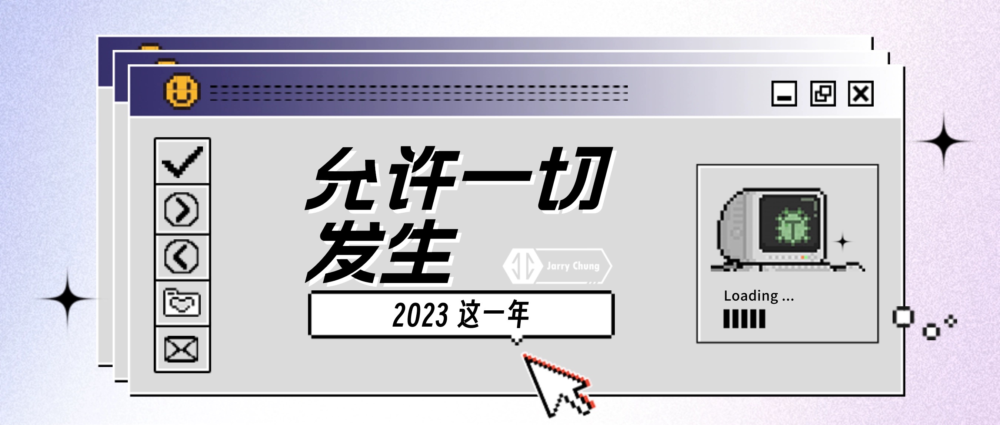

> 心中一定要有大世界。

今年过得很随意，所谓随意，就是没有「计划」。

迈入第二个五年规划（下称二五），本想沿用上一个五年规划的模式：制定计划、实施、阶段性检查、调整、总结。这其实就是[上一个年度总结](https://www.jarrychung.com/posts/annual/2022/)中提出的 PDCAR 循环。

但有三个契机促使我做了一些改变：
- 之前了解到的一个观点：生硬的计划会导致自身对外界破坏性的容纳度降低；
- 环境上的变化比较多，一些具体的计划往往很容易被破坏，需要利用习惯或者寻找更抽象的逻辑来支撑成长；
- 懒惰。

因此，二五的第一个计划，就是花一年的时间尝试不制定 OKR，以此验证第一个五年规划带来的收益与风险：
- 收益：即使没有 OKR，形成习惯且能坚持下来的有多少；
- 风险：处于生硬的计划的状态，对外界破坏性的容纳度降低了多少。

不妨先盘一下收益，能够坚持下来的、典型的习惯：
- 行为上，写日志、每日刷题、学英语、阅读可以无痛保持，但每月复盘不稳定了，表现为周期上朝不保夕，内容上浅尝辄止。其中，写日志融合了记录与事项管理，做到事毕即记，是目前主要的成长手段之一；
- 方法上，PDCAR 循环；
- 思维上，指导思想为「做真正有价值的事」以及「创造更大的价值」。

对于风险，具体来说，风险的根源在于我将个人目标与组织目标耦合了，也就意味着当组织目标发生改变时，个人目标也需要改变。这种改变会导致强烈的焦虑，进而拖累行动的节奏。

那么，能否将个人目标与组织目标解耦呢？我认为不能，如果区分了二者目标，也就意味着精力会分散在两个方向上，久而久之，要么组织目标被弱化，要么个人目标被弱化，总有一方会变成为了完成任务而成为枯燥的事项。

既然不能分割二者联系，那么就需要找到一种更抽象的逻辑来适应破坏性的变化。我寻找到的答案是「允许一切发生」。

在拟题之初，考虑过「接受一切发生」、「允许一切发生」，再三思量之下，选择了后者。因为前者更贴近于今年前期的状态，后者则是中后期的状态，更能代表今年大部分时间以及未来一段时间内的状态。更重要的，「允许一切发生」更能表达主动、积极改变的态度，并对改变及时做出响应，也有一定的正向反馈作用。

主动地、积极地面对突发事项，并抽象不同过程中的底层逻辑，在内心统一指导思想与措施，能够有效降低焦虑感，进而提升对破坏性的容纳度。

今年，我主要通过锻炼耐心与韧性的理念来面对事项，所谓耐心，是指坚持重复尝试的能力，所谓韧性，是指从挫折中恢复的能力。

为什么选择这两个呢？这是从我自身的缺陷考虑的。一直以来，我常常表现出急于求成、虎头蛇尾、浅尝辄止、见噎废食的状况，于成长有累卵之危、倒悬之急，必须做好这两个，才能走得长远。

行文至此，基本完成了本年的总结。在最后，记录下从「我是什么」的角度来看「允许一切发生」这个答案。

我是什么？个体上看，我是自身想法的总和，我是有意识的，我能影响我所在的环境。另一方面，群体上看，我不过是命运长河中被偶然点中的我，高光的我、黯淡的我，可能在下一刻就不再属于我。允许一切发生，保持空杯心态。
