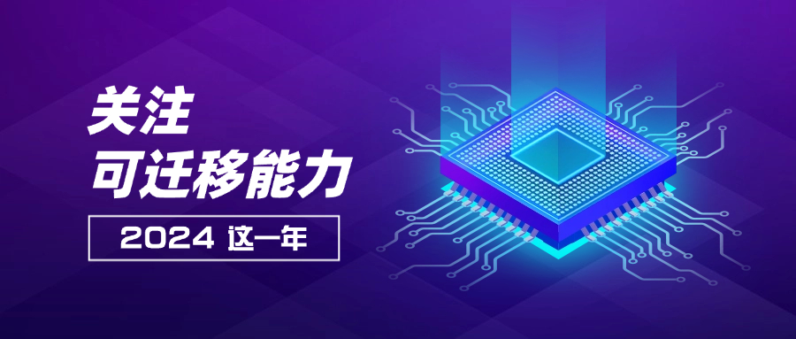
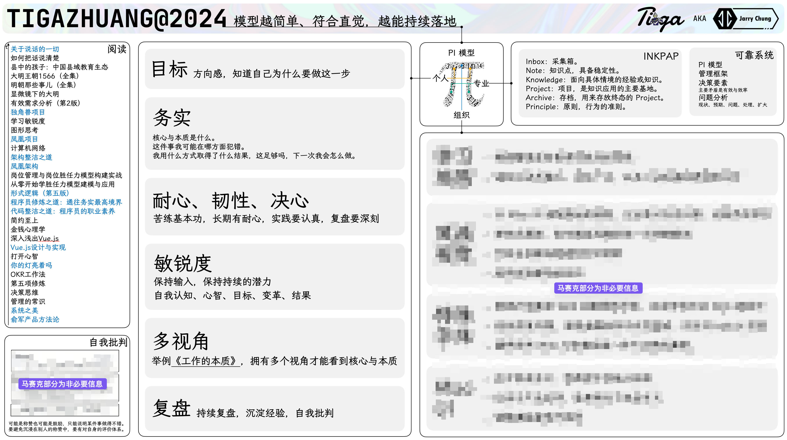
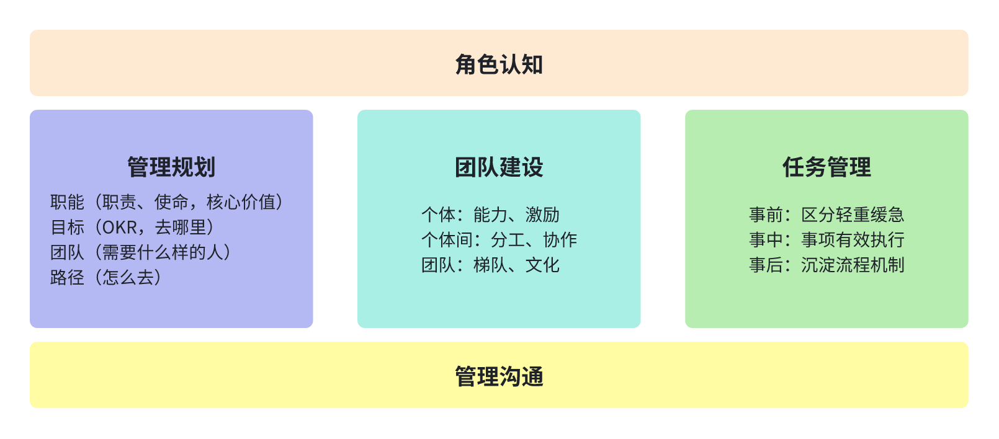

> 持续学习，持续实践，持续复盘。

2024 年，就以面试为引子开始说起吧。

年中我有相当一部分时间花在面试众多 Leader 或高级工程师上，于是自然而然地引出一个话题：如何判断候选人在技术能力上是否匹配？在持续复盘后，我总结出 5 个判断维度：
* 方案完备：方案是不是考虑周全，常见的包括需求理解、防抖节流、可观测、告警、性能、幂等性、兼容性等。
* 技术深度：会关注到 API 的源码、原理、规范，以及框架的设计理念。
* 决策逻辑：清晰自身为什么要这么做，而不是单纯接收指令执行且全无独立思考，这个往往决定方案的合理性。
* 落地能力：能否将决策、技术落地。
* 能力迁移：能否快速理解新领域的问题并给出初步方案。

其中，对于前四者，只要工作经验足够，我认为是相对容易获得的。但对于能力迁移，则会要求自身有持续学习、实践、复盘的习惯，是更能体现工程师能力的部分。没有完全一样的两个问题，关键在于能否将已有经验、逻辑迁移到新领域中去解决新问题。

以前，我常常谈论底层能力的重要性，但始终觉得这个概念有些模糊不清。怎么去定义它，或者它有哪些特性，是我的困惑。今年算是往前迈了一小步，明确了底层能力的一个关键特性：可迁移性。

关于能力迁移，不妨以前端开发为例。假设一位开发者从 React 转向 Vue。好的方式不是简单地将 React 的编码习惯直接应用于 Vue，而是采取以下策略：
1. 比较学习：深入理解 Vue 的核心概念和设计理念，并与 React 进行对比。
2. 寻找共通点：识别两个框架的相似之处，如组件化、状态管理等概念。
3. 辨别差异：明确 Vue 与 React 在语法、生命周期、数据流等方面的独特之处。
4. 经验迁移：将 React 中与 Vue 适用的最佳实践和设计模式灵活地应用到 Vue 开发中。
5. 遵循框架特性：在编码时利用 Vue 的特性，如响应式系统和模板语法。
这种方法可以确保代码符合 Vue 的设计哲学，提高可维护性和性能。相比之下，简单地用 React 的思维编写 Vue 代码，会让代码充斥着两种方言。真正的能力迁移不是生搬硬套，而是深入理解、灵活应用，并在新领域中创造最佳实践。

回到面试的场景，若是角色互换，我变成了候选人，我的可迁移能力有哪些呢？这个问题真是不好回答，它有几个难点：
* 可迁移能力之间的界限是什么？例如，持续复盘与解决性能问题就是两个领域的问题，前者更通用，后者更领域化。
* 该从何说起，或者说，该以什么样的结构来表达？

这两个问题的关键点在于，如何用一种符合直觉的可靠的模型来组织不同的可迁移能力？
* 符合直觉：降低记忆的心智负担，无需过多索引。
* 可靠：自己实践过，且验证可行的，但不一定是最优的，即它一定能处理问题。例如管理框架，能解决「全是杂活」的问题。

不妨通过现实场景来拆解，即按照人和事两个方面来初步拆解。考虑到个人通常会借助周边环境来发力，周边环境也会因个人而变化，因此可以进一步拆分出个人与组织。可以用稍微正式一些的词语来组织，即个人、组织、专业（见下图，注：第一个版本呈 T 形，当先版本考虑了管理事项，呈 Pi 形，持续迭代模型内容）。

以下就按照这个逻辑来展开 2024 的个人与专业上的重要事项吧。

关于个人，比较重要的两点是阅读与自我批判。

对于读书，今年仿佛突然读得懂书了，一共花了 730 小时读了 71 本书，为了方便看笔记，还做了个浏览器插件 [bookline](https://github.com/JarryChung/bookline)。对于读书过程的经验，倒是有几条值得记录：
* 读书的负担够低，才有可能享受读书，为此，全面转入到微信读书 + 墨水屏。
* 每个领域都有自己的语言，对于陌生领域，需要先花几个小时的时间熟悉书本语言后，才能真正判断出好不好，避免自己的阅读习惯影响判断。
* 避免同一时间交叉看不同领域的书，交叉领域读书会使得大脑频繁切换。
* 避免总想记住书本内容的倾向，大脑容量有限，可行性不高，另一方面，根据认知图式，如果无法关联的知识，死记硬背也是无效的。
* 如何有效应用书本知识，我做了分级处理：
    * 对于能关联的知识，为了能够应用，会通过 INKPAP 来记录，这是一种强打断阅读行为的方式，一般会先记录梗概，随后再补充。
    * 对于感觉不错但现阶段不适用的知识，通过划线评论来记录，再通过 bookline 导入到 obsidian，便于搜索。
* 沉淀了两个书单：
    * [一线技术 Leader 成长之路](https://weread.qq.com/misc/booklist/23128767_7VnpN4B3s)
    * [成长的原理与框架](https://weread.qq.com/misc/booklist/23128767_7WIEWKq56)

对于自我批判，关键目标是确定真实效果（极度求真），可以用费曼提问法来挖掘，以下是常用问题：
1. 前提是什么？
2. 目标是什么？
3. 一般情况下，如何达成目标？
4. 无法达成目标的情况，厉害的人会如何做？
5. 这件事的核心是什么？
6. 这件事的本质是什么？
7. 了解了本质的人，和不了解本质的人有什么不同？
8. 如何判断这件事的完成情况？
9. 做这件事，我可能在哪方面犯错？我可能在哪方面出色？
10. 这件事可以提升我哪方面的能力？
11. 这件事值得长期投入吗？
12. 这件事中，我已经用了怎样的方式取得了怎样的结果？这足够吗？
13. 外在的声音，是称赞事情做得好，抑或是鼓励？
14. 自己是否仍受制于他人评价？
15. 自己评价体系是怎样的？自己对这件事情的评价怎么样？

关于专业，INKPAP、管理框架、决策，是今年的主要收获。

对于 INKPAP，是《打开心智》中的 INKP 与我自己总结的 AP 结合起来的，是一种知识管理与应用方法，尤其强调知识的应用。它摒弃了知识分类的方式，转而用知识分阶段消化的理念来组织。其目标是以贴近现实生活的方式管理与应用知识，降低难度，以及以应用为导向，解决知识应用不稳定的问题。其主要阶段是：
* Inbox：采集箱，任何想法、片段都放到这个地方，需要被定时整理。
* Note：知识点，从采集箱整理而来，以名词命名，具备稳定性。
* Knowledge：知识、领域、经验，聚合知识点，面向具体情境的经验手册或知识。
* Project：项目，即当下正在进行的事项，这里关联了一系列本项目会使用到的知识、经验，是知识应用的主要基地；当 Project 完成后，务必沉淀经验到 Knowledge。
* Archive：存档，用来存放终态（已完成或已废弃）的 Project，记录执行过程，方便后续类似 Project 查找参照物。
* Principle：原则，行为的准则，当行为存在疑问时，可利用这部分内容判断。

管理框架则是学习自《知行》一书，可行性不错，以管理沟通为基础，以管理认知为牵引，持续做好看方向、做事、带人。

对于决策，则是在阅读《原则》中关于如何决策的章节时，突然认识到决策的主要矛盾是有效与效率。前者依赖怎么做决策，后者依赖何时做决策。
* 有效决策，该怎么做：方向可以是演绎和归纳，手段可以是实践、信息收集、数据、直觉等，组织方式可以是个人也可以是组织；
* 效率决策，该何时做：可逆的决策尽快做，不可逆的决策延后做。可逆是指撤销其影响的做功低于使其发生的做功，不可逆反之。

以上，是本年的主要体会，以下为随手记录。

关于绕不开的 AI，有两个点值得关注：
* 提出正确问题的能力，在未来比找到答案的能力更重要。
* 关于 DeepSeek，在解疑释惑之外，其思维链更值得学习。此链如珠玑，串联情景确认、角色辨识、潜在需求探析、事实依循、佐证搜罗、时效性考量、举一反三、结构化表达等诸多环节，让思考更周全。

最后，关于 2025 年，如何用好 AI 是一个重要话题，体现在两个方面：
* 对于人，如何通过 AI 来优化自己的成长体系；
* 对于事，如何通过 AI 来促成更多成果。

