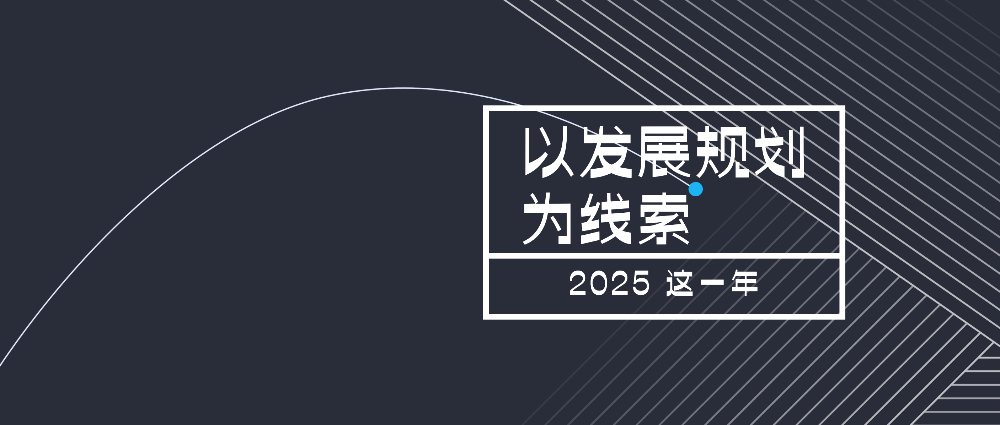



> 苦练基本功，长期有耐心。

本文标题是后拟的。

我本想通过一些关键词来梳理今年的诸多变化，却难以拟题，故本文收笔后，尝试通过找到一些不变点来拟题。最后用「发展规划」四个字，是因为在诸多可能诱发转折点的场景下给了我答案。

有清晰的发展规划，才有可能识别哪些困难是必须克服的，哪些困难是不应没苦硬吃的。

譬如，我在管理上遇到的一些困难，结合发展规划看，是必然会遇到的困难，除了解决，就只剩下停滞不前，所以应该将其看成机会，可以尽早尝试解法以获取经验。若是躲避，那么这个困难就会变成眼前的大山、头顶的天花板。有清晰的发展规划，才有可能锻炼韧性与决心。

以上是拟题时的感想，以下是围绕年度关键词展开的一些想法，长短不一。

管理基本功

在 2024 年度总结中，我提到主要使用的管理框架是《知行》中的汉堡包结构：认知先行、沟通串联看方向、带人、做事。

实践了一段时间，以及环境发生了改变，我发现这套理论偏向已知情况的具体管理，无法继续作为管理上的可靠系统来消化事项。后来，我综合一些书籍、分享、培训的内容，抽象出新的管理框架：

在周期内，分析主要矛盾，以 OKR 目标为方向，通过激励机制来牵引支撑目标的关键要素，并结合日常检查确保执行到位且符合预期。

展开来说，以绩效考核周期或关键成果周期为时间段，通过看清现实情况抓准主要矛盾，根据主要矛盾制定方向与目标（所有的周期内目标必须对解决主要矛盾有贡献），梳理达成目标所需要的关键要素（能力、事项等），激励这些关键要素。这里的重点是，不直接激励达成具体目标，而是激励达成目标的关键要素，以促进团队演化。由于不直接激励达成具体目标，可能会导致偏差，因此日常检查变得更加重要，是最终符合预期的基本保障。

三类活

上面重点说了管理。对于技术类的工作，大体上分为三类：技术、业务、管理。

阶段不同，工作重心不同。譬如，刚入职，最重要的是技术能力，随着经验丰富，会强调业务或管理，再往后发展，要么侧重技术（技术专家），要么侧重业务（业务专家），要么侧重管理（管理职能）。

读二十五史

今年花了 400 个小时阅读二十五史。

读史的初衷，是心中的两个问题：一是达成目标的基本素养是什么，二是如何评价自己。

达成目标的基本素养，最终发现四个字：识人、辨势，再加上契合社会导向的原则。

至于如何评价自己，读完后，豁然开朗，如何评价并不重要，重要的是自己所做的事情，是否跟随自己的内心，评价这件事，应当留给历史。

读史的额外收获，是「三类人理论」，是指在选择一家公司时，看这三类人即可。第一类是决定自己做什么事的人，这类人直接决定了工作体验；第二类是决定自己薪资的人，这类人直接决定了所做的活是否有价值，是匹配的第一步；第三类是决定公司战略的人，这类人决定了自己与公司共同成长的联盟时长。

事实上，在选择公司的前一步，应该是选择行业或赛道，对于这个选择，要契合自身优势，行业具备专业壁垒，处于快速发展阶段或能革命传统模式，核心还是在于与自身共同发展。

投资

今年有更频繁的交易操作，自然也是被上了一些课，记录一些印象深刻的：

放下顶部执念，做好风险控制。

分仓操作，本金稳健投资，部分收益激进投机。

阅读

阅读之外的收获，是总结如何判断一本好书：一是读起来自己有迷失感，说明在当下的自己看来，这本书自己看得懂一些但又有东西是新鲜的，能够吸收一些新的知识；二是能起鸡皮疙瘩的，与自己的内心发生了共情。每个人成长经历、生活体验各不相同，故第二类书往往更难得。

今年共阅读了 1121 个小时，61 本书，1.3 万条笔记，书目按时间顺序如下：

- 《了凡四训》（杭州四月天）
- 《了凡四训》（果麦文化）
- 《阿城文集之六：文化不是味精》
- 《人间游戏》
- 《AI帮你赢》
- 《统计学关我什么事：生活中的极简统计学》
- 《生活不是掷骰子：理性决策的贝叶斯思维》
- 《心中有数 生活中的数学思维》
- 《我们为什么要睡觉？》
- 《别让猴子跳回背上 (新版) 》
- 《山月记》
- 《谏逐客书》
- 《3小时快学期权 (第二版) 》
- 《越女剑 (轻经典) 》
- 《县城体制内女孩, 不想将就, 又怕结不了婚 (轻纪实) 》
- 《县城媒婆, 带找不到对象的男性跨省相亲 (轻纪实) 》
- 《门阀|"中古第一家族"琅琊王氏传承千年的成事智慧》
- 《90后断崖式衰老实录 (轻纪实) 》
- 《断魂枪 (轻经典) 》
- 《西安短剧群演生存记 (轻纪实) 》
- 《狂人日记 (轻经典) 》
- 《閫外春秋》
- 《外卖骑手, 困在系统里 (轻纪实) 》
- 《思维的乐趣 (轻经典) 》
- 《十香词》
- 《阿婆不识字, 却教我写人间书 (轻纪实) 》
- 《漫画版天机：孩子成长路上必懂的 66 种变通思维》
- 《韬晦术》
- 《二十五史简明读本 (全15册) 》
- 《革命军》
- 《金融市场运营管理》
- 《看懂金融的第一本书》
- 《三和大神：第一逆袭仔红牛哥 (轻故事) 》
- 《Securities Industry Essentials》（STC）
- 《Securities Industry Essentials》（dummies）
- 《心态制胜：超越评判、释放潜能的内在秘诀》
- 《推恩令：汉武帝的顶级阳谋》
- 《Proof Market Structure Primer》
- 《去爱这热气腾腾的人间：地铁民警眼中的众生百态》
- 《党委会的工作方法》
- 《蜉蝣直上》
- 《克拉拉与太阳 (彩虹版石黑一雄作品) 》
- 《Web 3.0漫游指南》
- 《用户体验定律：简单好用的产品设计法则》
- 《领导者的心智模型》
- 《SIE Exam Prep 2025-2026》
- 《寒窑赋》
- 《朱子治家格言》
- 《人生复本 (同名美剧原著) 》
- 《辜鸿铭：天朝最后一条辫子 (轻历史) 》
- 《制度、权力与国家兴衰—重温《国家为什么会失败》》
- 《解闷儿：张辰亮散文集》
- 《好的决策》
- 《财富的真相》
- 《成为更理性的人：法律如何实现正义》
- 《圆圈正义：作为自由前提的信念》
- 《逻辑女孩—论辩篇：我们是如何变得更聪明的？》
- 《概念力》
- 《向上管理的艺术：如何正确汇报工作》（内容垃圾）
- 《韭菜的自我修养》
- 《让时间陪你慢慢变富》

