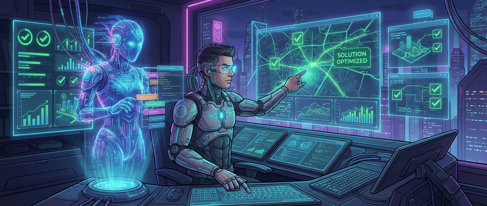

如果把我的工作拆开来看，它大致分为三个部分：

1. **发现问题**：找出哪些问题值得用代码来解决
2. **解决问题**：把解决方案翻译成代码，让计算机去执行
3. **验证问题已解决**：确认解决方案真的有效，没有带来新的问题

AI 或许终将能完全接管编码部分，甚至在某些场景辅助发现问题和验证结果。但无论工具如何演进，**仍然需要有人去感知真实世界的需求，定义值得解决的问题，并最终确认问题已经得到解决**。

而我工作内容的 80%，是**发现问题**和**验证问题已解决**：

- 不是所有的「麻烦」都是问题，不是所有的问题都值得用代码解决，不是所有值得用代码解决的问题都应该现在解决。判断这些，需要对业务的理解、对用户的感知、对资源的权衡，以及——经验。
- AI 可以列出一百个可能的方向，但它不知道哪一个对团队、产品、用户来说是最重要的。这件事需要人来做。
- 代码跑通了不等于问题解决了。用户真的在用这个功能吗？他们用得顺畅吗？新的逻辑有没有引入新的风险？数据指标有没有往预期的方向走？这些问题同样需要人去盯、去判断、去跟进。

因此，AI 编程对我的工作来说，是**加速器**，而不是**替代品**。
